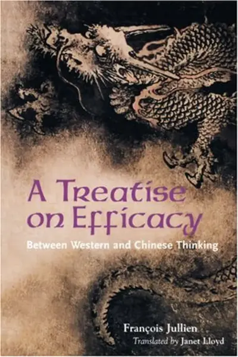
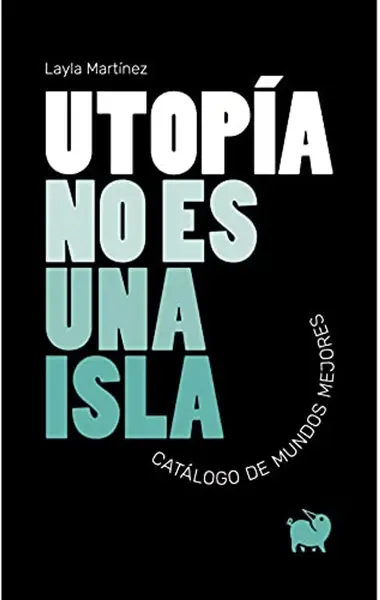
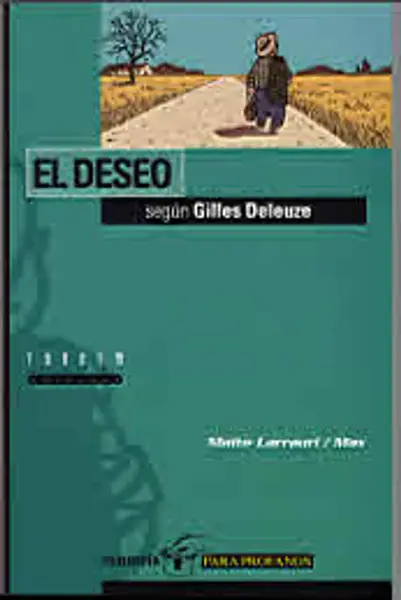
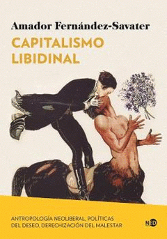
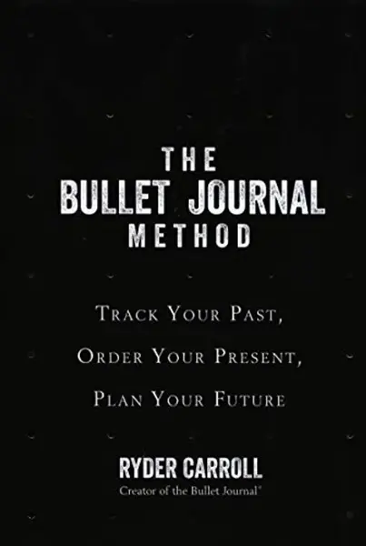
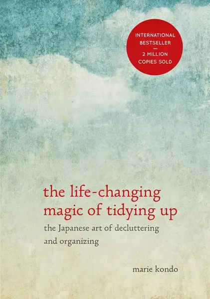
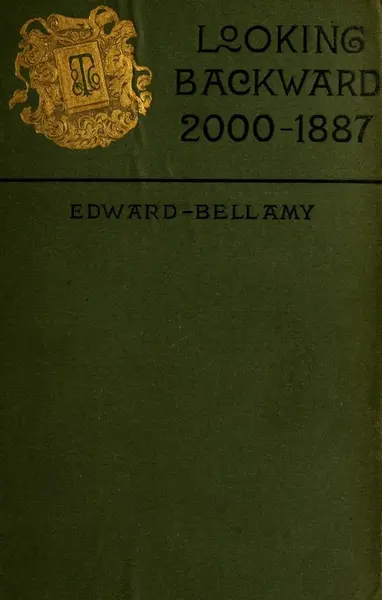

Aquí os dejo los libros que más me han marcado en la vida. Podéis ver otros que me haya leído en las [galas](galas_2025.md).

# Transformadores

Qué hacen un crack dentro de ti que te transforma

## Treatise on efficacy de François Jullien

- año: 2004
- género: filosofía
- longitud: 211 páginas
- última vez leído: 2025

Mi libro favorito del 2025 sin duda. Lo he leído 2 veces y media. Mucho
subrayado, muchas notas al margen. Es uno de esos libros que te dan unas
nuevas gafas para ver el mundo de otra forma.

Ha transformado completamente mi concepción del tiempo, la eficacia,
eficiencia, acción, transformación, oportunidad, ...

Eso si, es lectura densa, pero muy muy recomendable.

Me encanta el puente que nos regala Jullien del pensamiento chino vivido
y entendido desde la experiencia de ojos europeos.

## Utopía no es una isla de Layla Martínez

- año: 2020
- género: ensayo
- longitud: 212 páginas
- última vez leído: 2025

Una guía de vida, lo he vuelto a leer después de 3 o 4 años. Este libro
fue el que me dio las energías para volver a militar tras un largo
periodo de hartazgo y desilusión. También me abrió en su momento el
camino a buscar la utopía.

El libro te atrapa y es un viaje maravilloso.

## El deseo según Gilles Deleuze de Maite Larrauri

- año: 2000
- género: filosofía
- longitud: 94 páginas
- última vez leído: 2025

Lo "leí" cómo nunca antes había leído un libro, simplemente
maravilloso. Después lo he leído otras 2 veces.

Maite hace accesible a profanos conceptos clave de Deleuze sobre el
deseo.

## [Joyful militancy by carla bergman and Nick Montgomery](https://joyfulmilitancy.com/)

- última vez leído: 2024

Un libro muy interesante desde todas las perspectivas. Por cómo debió de ser el proceso creativo, por el cuidado y respeto a todos los distintos movimientos que representa, por las personas entrevistadas y las ideas que transmiten... Para mi ha sido un libro clave para una de las transformaciones más importantes de concepto de vida que he dado este año, entrar más en contacto con mi deseo y dejar que este fluya sobre las rigideces autoimpuestas entre otras cosas por el concepto del deber. Esto aplicado a mi vida en general y a mi militancia en particular.

Es cierto que la mayor parte de los conceptos transgresores son heredados del feminismo, pero el libro los refleja muy bien y puede ser un buen punto de entrada para los que no nos hemos zambullido aún muy profundamente en leer teoría feminista.

Why do radical movements and spaces sometimes feel laden with fear, anxiety, suspicion, self-righteousness and competition? The authors call this phenomenon rigid radicalism: congealed and toxic ways of relating that have seeped into radical movements, posing as the ‘correct’ way of being radical. In conversation with organizers and intellectuals from a wide variety of currents, the authors explore how rigid radicalism smuggles itself into radical spaces, and how it is being undone. Rather than proposing ready-made solutions, they amplify the questions that are already being asked among movements. Fusing together movement-based perspectives and contemporary affect theory, they trace emergent forms of trust, care and responsibility in a wide variety of radical currents today, including indigenous resurgence, anarchism, transformative justice, and youth liberation. Joyful Militancy foregrounds forms of life in the cracks of Empire, revealing the ways that fierceness, tenderness, curiosity, and commitment can be intertwined.

Interviewees include Silvia Federici, adrienne maree brown, Marina Sitrin, Gustavo Esteva, Tasnim Nathoo, Kian Cham, Leanne Betasamosake Simpson, Sebastian Touza, Walidah Imarisha, Margaret Killjoy, Glen Coulthard, Richard Day, Melanie Matining, Zainab Amadahy and Mik Turje.

## [Four thousand weeks by Oliver Burkeman](https://www.oliverburkeman.com/fourthousandweeks)

- última vez leído: 2024

Me ha encantado. Me flipa encontrar un libro de auto ayuda y time management con una perspectiva bastante anticapitalista. Probablemente es el mejor libro de gestión de tiempo que conozco, ha generado en mi esos momentos preciosos en los que surgen ideas fuera de los límites mentales que tenía antes. Ha sido bastante liberador y ha influido mucho en crear mi nueva manera de entender el tiempo y cómo navegarlo. Lo he utilizado mucho este año para rediseñar todos mis [roadmap adjustments](roadmap_adjustments.md), en especial el trimestral y el anual. Muy muy recomendable.

The average human lifespan is absurdly, outrageously, insultingly brief: if you live to 80, you have about four thousand weeks on earth. How should we use them best?

Of course, nobody needs telling that there isn't enough time. We're obsessed by our lengthening to-do lists, our overfilled inboxes, the struggle against distraction, and the sense that our attention spans are shrivelling. Yet we rarely make the conscious connection that these problems only trouble us in the first place thanks to the ultimate time-management problem: the challenge of how best to use our four thousand weeks.

Four Thousand Weeks is an uplifting, engrossing and deeply realistic exploration of this problem. Rejecting the futile modern obsession with 'getting everything done,' it introduces readers to tools for constructing a meaningful life, showing how the unhelpful ways we've come to think about time aren't inescapable, unchanging truths, but choices we've made, as individuals and as a society - and its many revelations will transform the reader's worldview.

Drawing on the insights of both ancient and contemporary philosophers, psychologists, and spiritual teachers, Oliver Burkeman sets out to realign our relationship with time - and in doing so, to liberate us from its grasp.

## [Verano sin vacaciones. Las hijas de la Costa del Sol por Ana geranios](https://piedrapapellibros.com/producto/verano-sin-vacaciones-las-hijas-de-la-costa-del-sol/)

- última vez leído: 2024

Libro que dolorosamente me quitó la venda de los ojos en cuanto al turismo y la restauración. Tiene un formato perfecto, la primera parte (Verano sin vacaciones) te llega a la patata haciéndote vivir en las entrañas lo podrido que está el sector y luego en la segunda (Las hijas de la Costa del Sol) le da forma de ensayo y te llega al coco.

Lo leímos en un club de lectura muy chulo organizado por la Escuela de las Periferias, que junto a Estuve aquí y me acordé de nosotros de Anna Pacheco, nos ayudó a tener unas discusiones super interesantes que terminaron de definir mi nuevo concepto sobre el turismo. Además tuve la suerte de asistir a una mesa redonda impresionante con Ana, Valeria del Sindicato de Inquilinas y dos compas de la PAH que le dieron distintos matices a la problemática de la vivienda que tenemos que sufrir. Y para colmo luego estuvimos rajando en un parque con Ana y luego dimos un paseo por el barrio. Un final maravilloso para un libro fantástico.

¿Cómo sería un mundo sin hostelería? ¿Es posible pensar en una sociedad en la que ninguna persona tuviera que servir ni ser servida, donde las bandejas no tuvieran ninguna utilidad?

Este libro no va de eso. Es justo lo contrario: el análisis de un sector económico que se enriquece gracias al trabajo de quienes se dedican a servir a un público que puede permitírselo.

Verano sin vacaciones es el diario de una trabajadora del sector hostelero de la costa malagueña; un relato al que se suma Las hijas de la Costa del Sol, un ensayo situado que nos interpela como turistas, pero también nos hace comprender qué hay detrás de una industria que descansa sobre la explotación laboral, el servilismo político y la voracidad ecológica.

El leitmotiv es hacernos preguntas, dialogar, pensar, compartir; imaginarnos, ahora sí, cómo sería un mundo sin hostelería.

## [Thinking in systems by Donella H. Meadows](https://donellameadows.org/systems-thinking-book-sale/)

- última vez leído: 2024

Me ha encantado. Al principio dudaba de la autora por no saber de que pie cojeaba pero al final es un libro que abre mentes. Muchas ganas de resumirlo. Al principio del año descubrí el concepto de [systems thinking](https://en.wikipedia.org/wiki/Systems_thinking) a way of making sense of the complexity of the world by looking at it in terms of wholes and relationships rather than by splitting it down into its parts. It has been used as a way of exploring and developing effective action in complex contexts, enabling systems change. Systems thinking draws on and contributes to systems theory and the system sciences.

Me maravilló la idea de tener un sistema nuevo y sistemático de analizar el mundo, me encantan los modelos y creo que systems thinking puede llegar a ser muy potente. De los cuatro libros que me leí del tema este es sin duda el mejor.

This is a primer that brings you to a tangible world where anyone can understand systems and engage with them in meaningful ways. The problems we face – war, hunger, poverty, climate change, racism, gender-based violence cannot be solved by quick fixes in isolation. We need to see the whole system and reach deeper to the structures and mindsets that are at play. Written with a hopeful and visionary tone, Thinking in Systems helps readers overcome confusion and helplessness, which is a first step in the work of change.

## Capitalismo libidinal

- año: 2024
- género: filosofía
- longitud: 224 páginas
- última vez leído: 2025

Libro maravilloso que me abrió la mente a otra concepción del tiempo y
del deseo.

La vida se ha hecho mercado. Como si fuese nuestra segunda naturaleza,
nos movemos en Uber, viajamos con Airbnb, ligamos en Tinder, compramos
en Glovo, nos entretenemos en Netflix, hablamos de nosotros mismos en el
lenguaje del capital humano.

Esta segunda naturaleza, que Amador Fernández-Savater llama capitalismo
libidinal, nos promete la felicidad, pero lo que produce realmente es
sufrimiento y malestar, en forma de precariedad, endeudamiento y dolor
psíquico. Paradójicamente, la derecha parece hoy más eficaz que nadie
para canalizar esa desesperación y su fuerza de rechazo (Trump,
Bolsonaro, Milei), mientras que las estrategias de comunicación y las
políticas de contención de la izquierda se muestran insuficientes.

¿Es posible reapropiarnos de nuestro malestar como energía de
transformación social? Será necesario aprender a escuchar y hablar el
lenguaje del cuerpo, imaginar y activar políticas del deseo.

## [The global police state by William I. Robinson](https://www.todostuslibros.com/libros/mano-dura_978-84-19158-52-9#synopsis)

- última vez leído: 2024

William ha puesto palabras bonitas y claras a mis pensamientos como no lo hacia un libro desde el manifiesto comunista hace muchos años. Un análisis impoluto sobre la crisis del capitalismo y el mundo al que nos estamos dirigiendo. A la vez que dando una dirección a la que apuntar para combatirlo. Ambiciosa y difícil, pero la que más me cuadra. Me encantaría debatirlo con la gente y lo regalaré allá donde vaya. Da un poco de yuyu porque hasta el final final final no da atisbo de luz al final del túnel tan necesaria en estos tiempos oscuros, pero aguantad, que merece la pena (✿◠‿◠).

A muchos nos aterra el nuevo auge del fascismo. Solo en Europa, la extrema derecha integra cinco gobiernos y tiene representación parlamentaria destacada en veintisiete países. Pero esto es apenas la punta del iceberg de un proceso bastante más complejo: el auge del Estado policial global como respuesta a la profunda crisis del sistema capitalista actual. A medida que el neoliberalismo dispara las desigualdades hasta límites insospechados (los veintiséis millonarios más importantes del mundo poseen hoy más de la mitad de la riqueza mundial mientras dos mil millones de personas viven en situación de pobreza), los individuos se vuelven «desechables». Una población excedente que supone una amenaza de rebelión para la clase capitalista. Para refrenarla, se hacen ubicuos todo tipo de sistemas de control, rastreos biométricos, encarcelamientos generalizados, barcos‐prisión, violencia policial, persecución de migrantes, represión contra activistas medioambientales, eliminación de prestaciones sociales, desahucios, precarización de las clases medias, guerras estratégicas sustentadas por capital privado... Así, el Estado policial global no remite ya a un mecanismo policial y militar, sino a la propia economía global como totalidad represiva, cuya lógica es tan mercantil como política y cultural. Y, mientras la codicia infinita de la clase dominante hunde al capitalismo en una crisis sin precedentes (llevando la degradación ecológica y el deterioro social a su límite absoluto), el neofascismo afianza su posición en ese Estado policial global cuyo objetivo es la exclusión coercitiva de la humanidad excedente. Basándose en datos estremecedores y argumentos incontrovertibles, William I. Robinson demuestra hasta qué punto el capitalismo del siglo XXI se ha convertido en un sistema absoluto de represión como único método para mantenerse en pie más allá de sus contradicciones terminales, y defiende la urgencia de crear un movimiento que trascienda los meros llamados a la justicia social y ataque a la yugular.

## The Bullet Journal method de Ryder Carroll

- año: 2018
- género: autoayuda
- longitud: 320 páginas
- última vez leído: 2025

Un libro que me ha dado muchísimas ideas, pero para disfrutarlo tienes
que ser capaz de obviar toda la mierda que lo rodea: su speech sobre su
vida típico de libro de autoayuda, su enfoque belicista épico, horrenda
visión individualista de que somos culpables de nuestras situaciones y
que sólo nosotros podemos arreglarlas con una salida individual.

For years, Ryder Carroll tried countless organizing systems, online and
off, but none of them fit the way his mind worked. Out of sheer
necessity, he developed a method called the Bullet Journal that helped
him become consistently focused and effective. When he started sharing
his system with friends who faced similar challenges, it went viral.
Just a few years later, to his astonishment, Bullet Journaling is a
global movement. The Bullet Journal Method is about much more than
organizing your notes and to-do lists. It's about what Carroll calls
"intentional living": weeding out distractions and focusing your time
and energy in pursuit of what's truly meaningful, in both your work and
your personal life. It's about spending more time with what you care
about, by working on fewer things. Carroll wrote this book for
frustrated list-makers, overwhelmed multitaskers, and creatives who need
some structure. Whether you've used a Bullet Journal for years or have
never seen one before, The Bullet Journal Method will help you go from
passenger to pilot of your own life.

## The Life-Changing Magic of Tidying Up de Marie Kondo

- año: 2014
- género: autoayuda
- longitud: 231 páginas
- última vez leído: 2025

Me pilló en la mudanza y de nuevo quitando toda la mierda capitalista y
las grilladas japas, tiene ideas de trasfondo muy interesantes.

Japanese cleaning consultant Marie Kondo takes tidying to a whole new
level, promising that if you properly simplify and organize your house
once, you'll never have to do it again. Most methods advocate a
room-by-room approach, which doom you to pick away at your piles of
stuff forever. The KonMari Method, with its revolutionary
category-by-category system, leads to lasting results. In fact, none of
Kondo's clients have lapsed (and she still has a three-month wait
list).

With detailed guidance for determining which items in your house "spark
joy" (and which don't), this international best-seller featuring
Tokyo's newest lifestyle phenomenon will help you clear your clutter
and enjoy the unique magic of a tidy home - and the calm, motivated
mindset it can inspire.

# Impresionantes

## Looking Backward, 2000-1887 de Edward Bellamy

- año: 1888!!
- género: novela, sci-fy
- longitud: 276 páginas
- última vez leído: 2025

Ha despertado en mi sentimientos e ideas como no lo ha hecho un libro en
mucho tiempo. Sobretodo la sorpresa de que mucho de la actualidad es
realmente muy antigua.

Empecé leyéndolo en inglés pero no me enteraba de nada. El estilo
tampoco me estaba enganchando. Hasta que descubrí que se escribió en el
1888!!! También ayuda a entender aquellas cosas que rechinan, como
hablar sólo "del hombre".

Es impresionante y triste que ya imagina ideas socialistas aún
inalcanzables que me siguen emocionando aún en 2025...

Flipo con la perspectiva feminista de los cuidados, la visión del
trabajo, el antipunitivismo (imaginaba ya un mundo sin cárceles) ya en 1888. Me sorprende que habla de desahucios en masa, fraudes millonarios,
especulaciones con productos de primera necesidad. Luego tiene ciertos
campos en los que es un poco mas meh: la sanidad pública está un poco
retrasada, la parte romántica es horrenda, es bastante clasista y
tecnócrata. Y es muy curioso a la par que gracioso, con todo los avances
que ha sido capaz de imaginar, que no pudiese ver el final de la
religión.

El flipe se me relajó cuando vi que el manifiesto comunista se había
escrito 40 años antes. Y luego vino el efecto rebote. En vez de ser una
lectura inspiradora, que también, me está entrando un poco de
desesperación por la mierda de mundo que me está tocando vivir, lo lejos
que estamos de un mundo bello de vivir, y a la velocidad a la que nos
estamos alejando

Es una bonita crónica del despertar comunista cuando se te cae la venda
de los ojos. Apaga la tele, enciende la mente. En el paseo por el barrio
pobre hace una bonita descripción del quitar la venda de la
deshumanización del pobre como vía de acabar con dicha opresión.

Me ha gustado mucho el final y el tierno epílogo, se mascaba la
revolución rusa ya en el 1888 Qué pena que el capitalismo saliese
victorioso... Dónde estaríamos ahora si no...

A man being put into a hypnotic sleep, is awakened 113 years later to an
entirely new social structure.

# Novela

## [Mejor la ausencia de Edurne Portela](https://edurneportela.com/mejor-la-ausencia/)

- última vez leído: 2024

Lo empecé el 6 de marzo y esa noche me leí 209 páginas. A las 5:35 dije que ya era suficiente, aunque me fuese rabia no terminarmelo en un día. Hoy ha caído en la madrugada del 7 al 8 de marzo. Muy icónico todo, ya no me da rabia haberlo acabado hoy. Me ha maravillado, cómo escribe Edurne, es una pasada. Te coje con la primera frase y es tu cuerpo el que suplica que dejes de leer. No hay piedad. El cambio de lenguaje a medida que va avanzando la vida de Amaia es alucinante . Cómo le da un repaso a todo el conflicto de Euskadi visto desde alguien que sin estar dentro está salpicada. No se si tuvo miedo al publicarlo, es bastante crítica con toda la movida. Me sorprende porque ella si que está politizada. He pensado que me gustaría preguntarle su opinión respecto a lo que pasó y como ella lo vivió. He pensado varias veces a lo largo de la novela si es autobiográfica. Es impresionante que sea su primera novela.

Ha sido un año del (no estoy seguro de si bien llamado) conflicto vasco, ya que también leí Las fieras de Clara Usón que también me gustó mucho.

Crecer siempre implica alguna forma de violencia, contra uno mismo o contra aquellos que quieren imponer su autoridad. Cuando además la vida trascurre en un pueblo de la margen izquierda del Nervión durante los años 80 y 90, y todo es heroína, paro, detritus medioambiental, cuando en las calles silban cada semana las pelotas de goma y los gases lacrimógenos y las paredes están llenas de consignas asesinas, la violencia no es sólo un problema personal. Mejor la ausencia nos presenta una familia destruida, atravesada por la violencia de su entorno. Amaia, la pequeña de cuatro hermanos, narra ese entorno brutal desde su mirada de niña y adolescente. Compartimos con ella su miedo, su perplejidad, su rabia, ante un padre que hiere, una madre que se esconde, tres hermanos que, como ella, sólo buscan salir adelante.

Amaia es la joven que se enfrenta, hasta alcanzar sus propios límites, a este mundo hostil. Amaia es también la mujer que años después vuelve a su pueblo para encontrarse con un pasado irresuelto. En ese camino de ida y vuelta, en sus huidas y regresos, descubrirá, a su pesar, que nadie escapa del entorno en el que se cría, de la familia que le toca en suerte. Y que reconocerlo es la única manera de sobrevivir.
