Los premios al mejor contenido de 2025.

- [Mejores libros de 2025](#mejores-libros-de-2025)
- [Mejores series de 2025](#mejores-series-de-2025)
- [Mejores películas de 2025](#mejores-películas-de-2025)
- [Mejores podcasts de 2025](#mejores-podcasts-de-2025)
- [Mejores videojuegos de 2025](#mejores-videojuegos-de-2025)

# Mejores libros de 2025

- [Treatise on efficacy de François Jullien](#tratise-on-efficacy-de-françois-jullien)
- [El deseo según Gilles Deleuze de Maite Larrauri](#el-deseo-según-gilles-deleuze-de-maite-larrauri)
- [Looking Backward, 2000-1887 de Edward Bellamy](#looking-backward,-2000-1887-de-edward-bellamy)

## Transformadores

Qué hacen un crack dentro de ti que te transforma

### Treatise on efficacy de François Jullien

- disfrute: ★★★★★
- año: 2004
- género: filosofía
- longitud: 211 páginas

Mi libro favorito del año sin duda. Lo he leído 2 veces y media. Mucho
subrayado, muchas notas al margen. Es uno de esos libros que te dan unas
nuevas gafas para ver el mundo de otra forma.

Ha transformado completamente mi concepción del tiempo, la eficacia,
eficiencia, acción, transformación, oportunidad, ...

Eso si, es lectura densa, pero muy muy recomendable.

Me encanta el puente que nos regala Jullien del pensamiento chino vivido
y entendido desde la experiencia de ojos europeos.

### El deseo según Gilles Deleuze de Maite Larrauri

- disfrute: ★★★★★
- año: 2000
- género: filosofía
- longitud: 94 páginas

Lo "leí" cómo nunca antes había leído un libro, simplemente
maravilloso. Después lo he leído otras 2 veces.

Maite hace accesible a profanos conceptos clave de Deleuze sobre el
deseo.

### Capitalismo libidinal

- disfrute: ★★★★★
- año: 2024
- género: filosofía
- longitud: 224 páginas

Libro maravilloso que me abrió la mente a otra concepción del tiempo y
del deseo.

La vida se ha hecho mercado. Como si fuese nuestra segunda naturaleza,
nos movemos en Uber, viajamos con Airbnb, ligamos en Tinder, compramos
en Glovo, nos entretenemos en Netflix, hablamos de nosotros mismos en el
lenguaje del capital humano.

Esta segunda naturaleza, que Amador Fernández-Savater llama capitalismo
libidinal, nos promete la felicidad, pero lo que produce realmente es
sufrimiento y malestar, en forma de precariedad, endeudamiento y dolor
psíquico. Paradójicamente, la derecha parece hoy más eficaz que nadie
para canalizar esa desesperación y su fuerza de rechazo (Trump,
Bolsonaro, Milei), mientras que las estrategias de comunicación y las
políticas de contención de la izquierda se muestran insuficientes.

¿Es posible reapropiarnos de nuestro malestar como energía de
transformación social? Será necesario aprender a escuchar y hablar el
lenguaje del cuerpo, imaginar y activar políticas del deseo.

### Utopía no es una isla de Layla Martínez

- disfrute: ★★★★★
- año: 2020
- género: ensayo
- longitud: 212 páginas

Una guía de vida, lo he vuelto a leer después de 3 o 4 años. Este libro
fue el que me dio las energías para volver a militar tras un largo
periodo de hartazgo y desilusión. También me abrió en su momento el
camino a buscar la utopía.

El libro te atrapa y es un viaje maravilloso.

### The Life-Changing Magic of Tidying Up de Marie Kondo

- disfrute: ★★★★☆
- año: 2014
- género: autoayuda
- longitud: 231 páginas

Me pilló en la mudanza y de nuevo quitando toda la mierda capitalista y
las grilladas japas, tiene ideas de trasfondo muy interesantes.

Japanese cleaning consultant Marie Kondo takes tidying to a whole new
level, promising that if you properly simplify and organize your house
once, you'll never have to do it again. Most methods advocate a
room-by-room approach, which doom you to pick away at your piles of
stuff forever. The KonMari Method, with its revolutionary
category-by-category system, leads to lasting results. In fact, none of
Kondo's clients have lapsed (and she still has a three-month wait
list).

With detailed guidance for determining which items in your house "spark
joy" (and which don't), this international best-seller featuring
Tokyo's newest lifestyle phenomenon will help you clear your clutter
and enjoy the unique magic of a tidy home - and the calm, motivated
mindset it can inspire.

### The Bullet Journal method de Ryder Carroll

- disfrute: ★★★★☆
- año: 2018
- género: autoayuda
- longitud: 320 páginas

Un libro que me ha dado muchísimas ideas, pero para disfrutarlo tienes
que ser capaz de obviar toda la mierda que lo rodea: su speech sobre su
vida típico de libro de autoayuda, su enfoque belicista épico, horrenda
visión individualista de que somos culpables de nuestras situaciones y
que sólo nosotros podemos arreglarlas con una salida individual.

For years, Ryder Carroll tried countless organizing systems, online and
off, but none of them fit the way his mind worked. Out of sheer
necessity, he developed a method called the Bullet Journal that helped
him become consistently focused and effective. When he started sharing
his system with friends who faced similar challenges, it went viral.
Just a few years later, to his astonishment, Bullet Journaling is a
global movement. The Bullet Journal Method is about much more than
organizing your notes and to-do lists. It's about what Carroll calls
"intentional living": weeding out distractions and focusing your time
and energy in pursuit of what's truly meaningful, in both your work and
your personal life. It's about spending more time with what you care
about, by working on fewer things. Carroll wrote this book for
frustrated list-makers, overwhelmed multitaskers, and creatives who need
some structure. Whether you've used a Bullet Journal for years or have
never seen one before, The Bullet Journal Method will help you go from
passenger to pilot of your own life.

### Unf\*ck Your Habitat de Rachel Hoffman

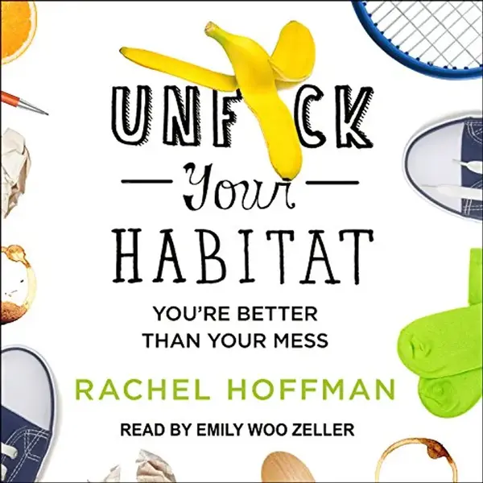

- disfrute: ★★★★☆
- año: 2017
- género: autoayuda
- longitud: 256 páginas

## Impresionantes

### Looking Backward, 2000-1887 de Edward Bellamy

- disfrute: ★★★★★
- año: 1888!!
- género: novela, sci-fy
- longitud: 276 páginas

Ha despertado en mi sentimientos e ideas como no lo ha hecho un libro en
mucho tiempo. Sobretodo la sorpresa de que mucho de la actualidad es
realmente muy antigua.

Empecé leyéndolo en inglés pero no me enteraba de nada. El estilo
tampoco me estaba enganchando. Hasta que descubrí que se escribió en el
1888!!! También ayuda a entender aquellas cosas que rechinan, como
hablar sólo "del hombre".

Es impresionante y triste que ya imagina ideas socialistas aún
inalcanzables que me siguen emocionando aún en 2025...

Flipo con la perspectiva feminista de los cuidados, la visión del
trabajo, el antipunitivismo (imaginaba ya un mundo sin cárceles) ya en 1888. Me sorprende que habla de desahucios en masa, fraudes millonarios,
especulaciones con productos de primera necesidad. Luego tiene ciertos
campos en los que es un poco mas meh: la sanidad pública está un poco
retrasada, la parte romántica es horrenda, es bastante clasista y
tecnócrata. Y es muy curioso a la par que gracioso, con todo los avances
que ha sido capaz de imaginar, que no pudiese ver el final de la
religión.

El flipe se me relajó cuando vi que el manifiesto comunista se había
escrito 40 años antes. Y luego vino el efecto rebote. En vez de ser una
lectura inspiradora, que también, me está entrando un poco de
desesperación por la mierda de mundo que me está tocando vivir, lo lejos
que estamos de un mundo bello de vivir, y a la velocidad a la que nos
estamos alejando

Es una bonita crónica del despertar comunista cuando se te cae la venda
de los ojos. Apaga la tele, enciende la mente. En el paseo por el barrio
pobre hace una bonita descripción del quitar la venda de la
deshumanización del pobre como vía de acabar con dicha opresión.

Me ha gustado mucho el final y el tierno epílogo, se mascaba la
revolución rusa ya en el 1888 Qué pena que el capitalismo saliese
victorioso... Dónde estaríamos ahora si no...

A man being put into a hypnotic sleep, is awakened 113 years later to an
entirely new social structure.

## Entretenidos

Un pasatiempos agradable. Para días tontos.

### Ñu de Pau luque

- disfrute: ★★★★☆
- año: 2024
- género: filosofía

Pau tiene una curiosa manera de filosofar, más cercana a la gente.Se lee
muy bien, te ríes bastante a menudo. Eso si, no tiene un sólo capítulo,
y eso hace que sea muy jodido dejar de leerlo.

Me hace mucha gracia Curiel, pienso que me gustaría conocerla pero luego
pienso, que menudo vértigo!

«Lo más sospechoso de las soluciones es que se las encuentra siempre que
se quiere.» Esta frase de Rafael Sánchez Ferlosio abre un libro
excepcional, tan brillante como inclasificable. Entre el relato, la
autobiografía y el ensayo filosófico, Pau Luque convoca una galería de
personajes extravagantes y tiernos para pensar con ellos la
incertidumbre que caracteriza a toda existencia humana: bellos italianos
de oficio desconocido, boxeadores frustrados, adolescentes con
dentaduras caóticas, poetas clandestinas, émulos de san Ignacio de
Loyola, filósofos abrumados por las cuestiones prácticas más triviales o
swingers confundidos vagan y divagan por las calles de Barcelona,
Génova, Ciudad de México o Vilafranca del Penedès. Son criaturas
mugrientas y deslumbrantes que se enfrentan a problemas cotidianos pero
también trascendentales.

Frente a las soluciones simples (el ñu que se suele utilizar en los
crucigramas en español para rellenar huecos --casi un chiste entre los
aficionados--) y a las recetas de manual, Pau Luque hace una loa a los
secretos, los equívocos, los errores e incluso las contradicciones. Ñu
es un iluminador libro de antiayuda.

### We have always lived in the castle de Shirley Jackson

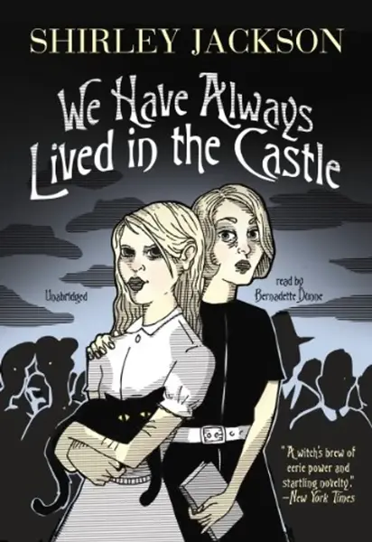

- disfrute: ★★★★☆
- año: 1962
- género: novela, drama
- longitud: 187 páginas

Recomendado por Layla Martinez, autora de utopía no es una isla y
carcoma, el estilo ne recuerda mucho a Aury en the slow regard of silent
things.

La casa tiene mucha presencia como en carcoma. Al principio hubo un
momento que casi lo dejo, pero me alegro de haberlo acabado.

El estilo es curioso y agradable de leer, me cuadra que le guste a
layla.

Shirley Jackson's beloved gothic tale of a peculiar girl named Merricat
and her family's dark secret

Taking readers deep into a labyrinth of dark neurosis, We Have Always
Lived in the Castle is a deliciously unsettling novel about a perverse,
isolated, and possibly murderous family and the struggle that ensues
when a cousin arrives at their estate.

### Una belleza terrible de Edurne Portela

- disfrute: ★★★★☆
- año: 2025
- género: novela histórica
- longitud: 335 páginas

Una mirada novelada a la historia de mujeres troskistas. Al final
engancha pero me costaron un poco ciertas partes.

Algunos pensamientos que fui apuntando mientras lo leía:

- Ay qué ilusión me dio ver que había sacado un nuevo libro. Al leer
  la descripción no me pude contener y empecé a dar palmadas y emitir
  ruidos nerviosos.
- Ya lo tengo entre mis manos, huele bien, como todos los de
  gutenberg.
- El primer capítulo me encanta, no solo leo su obra sino que encima
  la acompaño en esta aventura. Me recuerda un poco a su reflexión con
  maddie y las fronteras pero está vez está acompañada y la reflexión
  es más madura. Debe ser que Maddie le dio fuerzas. Al decir que
  compartía casa con jose ovejero me puse a buscar como loco si eran
  pareja, y luego pensé, qué más da!
- De nuevo, como en sus otros libros, el estilo de la escritura te
  atrapa, ay qué bien tener estas 300 páginas por delante.
- Me gusta cómo se centra en las historias de ellas incluso cuando
  están rodeadas de peña tan importante
- Me gusta mucho su filosofía de escritura, el imaginar sobre el
  inventar incluso a costa de potencial novelístico. Creo que tiene
  mucho más fuerza y es mucho más respetuosa por las historias
  verdaderas que intentan representar.
- Sus finales que siempre son maravillosos Ganas de comentarla con
  henar, caps y rosa

### A Deadly Education de Naomi Novik

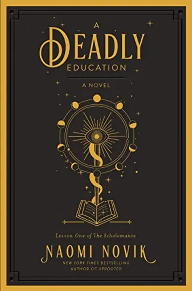

- disfrute: ★★★★☆
- año: 2020
- género: novela fantasía mágica
- longitud: 320 páginas

Crea un mundo muy interesante, es como un harry potter más oscuro.

# Mejores series de 2025

Este 2025 mis series favoritas han sido:

1. [Say nothing](#say-nothing)
2. [Adolescencia](#adolescencia)
3. [Animal](#animal)

## Impactantes

Contenido original, que deja su huella.

### Say nothing

- disfrute: ★★★★★
- año: 2024
- género: drama
- longitud: 9 episodios

Ambientada a lo largo de toda la historia del IRA, es interesante que no cuentan la versión de los vencedores, sin dejar de ser crítica con los vencidos. Me sorprendieron mucho los paralelismos con ETA.

Cada capítulo es una joya. Probablemente la mejor serie que he visto en 2025.

### Adolescencia

- disfrute: ★★★★★
- año: 2024
- género: drama, crimen
- longitud: 4 episodios largos e intensos

Serie que engancha muy fuertemente, que nos hace reflexionar sobre la relación adulto - joven, el papel de la tecnología y a donde tiende el mundo.

Creo que es una serie que deberían de ver todos los padres y madres con sus hijes, también en los institutos. Creo que se podrían generar unos debates muy ricos.

El formato también es muy especial. La grabación contínua hace que la acción no te deje un respiro. Yo pensaba que el formato de grabación contínua lo conseguían haciendo cortes y uniéndolo con efectos gráficos, pero no. Cada capítulo está grabado de un tirón, y si se equivocan, a empezar de nuevo. Flipo.

Cómo actua todo el reparto es impresionante.

El único pero que le pongo es que sólo muestra una visión muy pesimista de la juventud, en la que es fácil caer en la desesperación de que no tienen remedio y nos vamos al carajo. Que aunque es cierto, también hay otra gran cantidad de jóvenes que vienen pisando con mucha fuerza sobre los que podríamos aprender mucho.

El mundo de una familia se pone patas arriba cuando Jamie Miller, de 13 años, es arrestado y acusado de asesinar a una compañera de clase. Los cargos contra su hijo les obliga a enfrentarse a la peor pesadilla de cualquier padre.

## Tiernas

Contenido de domingo noche, aquel que te abraza, que es calentito, en el que los personajes se convierten parte de tu familia.

### Doctor en Alaska

- disfrute: ★★★★★
- año: 1990
- género: comedia, drama, fantasía
- longitud: 110 episodios

Zona de comfort absoluta que ha envejecido genial. Después de verla hace unos años, he revisitado capítulos sueltos con la familia. Si no la has visto es un acompañamiento bueno para el invierno.

Joel Fleishman es un médico recién licenciado. Debido a una cláusula de la letra pequeña del contrato de su beca acaba en la remota y descaradamente extraña ciudad de Cicely (Alaska). Cordialmente bienvenido por el fundador de Cicely, Maurice Minnifield, antiguo astronauta de la NASA, y por el resto de la peña de inadaptados y excéntricos que forma el vecindario, Joel descubre que es cada vez más difícil abandonar la ciudad a la que inconscientemente ha llegado. Todo se complica por la presencia de Maggie O'Connell, alcaldesa de Cicely y piloto de la localidad, una mujer hermosa pero completamente independiente; ambientado todo ello por el musical y filosófico programa de radio presentado por Chris en la KBHR.

## Graciosas

Contenido que arranca carcajadas

### Animal S01

- disfrute: ★★★★★
- año: 2025
- género: comedia
- longitud: 9 episodios

La serie más graciosa que he visto en el año. Carcajada tras carcajada, la retranca gallega en todo su explendor. Mais unha pena que non fose en galego :(

Antón, un veterinario sin un duro, acepta trabajar en una tienda de mascotas de lujo y pasa de cuidar animales en el campo a vender cucaditas y caprichos para perros mimados.

### División Palermo S02

- disfrute: ★★★★☆
- año: 2025
- género: comedia
- longitud: 6 episodios

Quizá es por la pérdida de novedad, pero no me reí tanto como con la primera. Aun así tiene muchos puntos muy muy graciosos.

Una Guardia Urbana inclusiva, ideada como operación de marketing para mejorar la imagen de las fuerzas de seguridad, descubrirá algo que no debía y se enfrentará con unos extraños narcos.

### The Bear S03

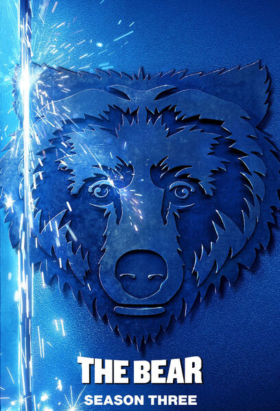

- disfrute: ★★★★☆
- año: 2024
- género: comedia, drama
- longitud: 6 episodios

### Su majestad S01

- disfrute: ★★★★☆
- año: 2025
- género: comedia
- longitud: 7 episodios

Me la vi casi del tirón en un momento de bajona anímica. Es muy divertido cómo se mete con los borbones, pero duele que consigue que al final empatices con ella. Maldito cine.

Cuando se ve salpicado por un escándalo financiero, el rey Alfonso XIV decide apartarse de la primera línea pública durante unos meses. Pero alguien debe quedarse al frente de la institución. No hay más alternativa que su única hija, Pilar. Ahora la princesa tendrá que demostrarle al país que no es la irresponsable, vaga e inútil que todos creen. Lo que pasa es que igual tienen razón.

## Entretenidas

Un pasatiempos agradable. Para días tontos.

### Detective Touré

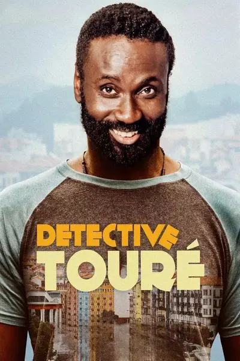

- disfrute: ★★★★☆
- año: 2024
- género: comedia, misterio
- longitud: 6 episodios

Es bastante divertida y está genial cómo meten el contenido político

Touré, un inmigrante guineano asentado en Bilbao, se gana la vida como improvisado detective de poca monta. Su pericia, intuición y particular sentido del humor le hacen ganarse la confianza de la Ertzaintza y le sumergen en una compleja investigación en la que se enfrentará a múltiples peligros: conocerá de cerca la corrupción inmobiliaria, los tejemanejes del conflictivo barrio de San Francisco e incluso se topará con la mafia nigeriana.

### Andor S02

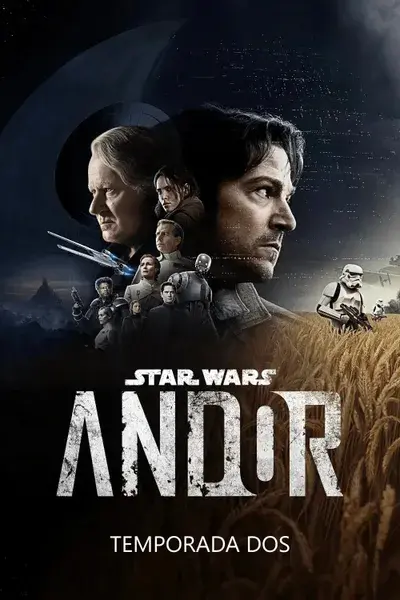

- disfrute: ★★★★☆
- año: 2025
- género: comedia, crímen
- longitud: 12 episodios

No le llega a la suela del zapato de la primera temporada (que si no has visto, merece mucho la pena). Pero sigue siendo entretenida, empieza flojilla y va ganando con los episodios.

Son bonitos los guiños a Palestina

### Eric

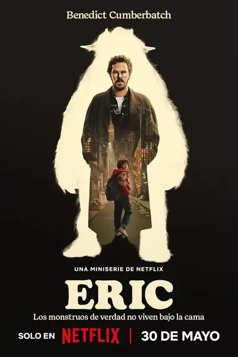

- disfrute: ★★★★☆
- año: 2025
- género: drama, misterio
- longitud: 6 episodios

Un padre desesperado y un tenaz policía luchan contra sus propios demonios en la Nueva York de los años 80 mientras buscan a su hijo de nueve años, que ha desaparecido.

### La residencia S01

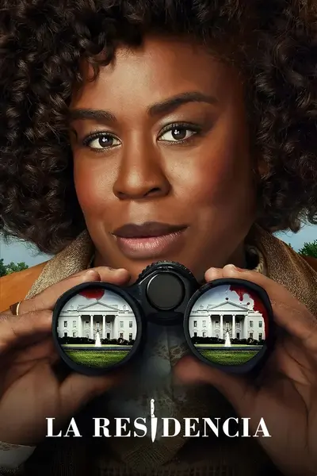

- disfrute: ★★★★☆
- año: 2025
- género: comedia, crímen
- longitud: 8 episodios

Empieza un poco flojilla pero con el tiempo va mejorando.

Una excéntrica y brillante inspectora investiga un crimen en la Casa Blanca, donde todos los empleados e invitados a la cena de Estado esconden un secreto y podrían ser el asesino.

# Mejores películas de 2025

Este año mis películas favoritas han sido:

1. [Arsénico por compasión](#arsénico-por-compasion)
1. [Coco](#coco)
1. [El gran dictador](#el-gran-dictador)
1. [Barrio](#barrio)
1. [Tiempos modernos](#tiempos-modernos)

Es curioso cómo ha pesado el cine antíguo frente al moderno.

## Transformadoras

### Barrio

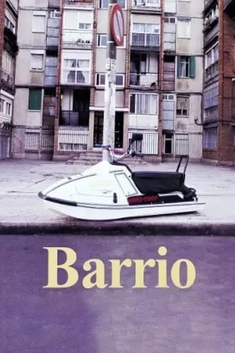

- disfrute: ★★★★★
- año: 1998
- género: drama
- longitud: 1h34m

En uno de esos barrios situados al sur de las grandes ciudades, a los
que no llega ni el metro ni el dinero, Javi, Manu y Rai son compañeros
de instituto, pero, sobre todo, amigos. Tienen esa edad en la que ni se
es hombre ni se es niño, en la que se habla mucho de chicas y muy poco
con ellas. Comparten también la vida en el barrio, el calor del verano y
un montón de problemas. El primero es el propio barrio, un lugar de
grandes bloques de viviendas sociales, de ladrillo oscuro y arquitectura
deprimente y depresiva. Allí hay pocas cosas que hacer, y en agosto aún
menos. El centro de la ciudad queda lejos y las comunicaciones son
malas, así que los tres amigos pasan la mayor parte del tiempo por las
calles del barrio.

### No Other Land

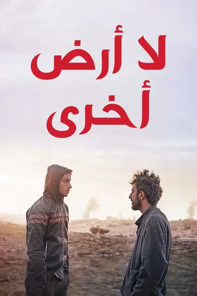

- disfrute: ★★★★★
- año: 2024
- género: documental
- longitud: 1h25m

Podría haber caído tanto en impactante como en transformadora. Una
producción muy necesaria tras más de un año de genocidio en Palestina...

Un joven activista palestino documenta durante cinco años los violentos
desalojos de palestinos en Cisjordania. Con la colaboración de cineastas
israelíes y palestinos, narra la compleja relación que surge entre él y
un periodista israelí dispuesto a unirse a su lucha, a pesar de sus
diferentes circunstancias. Una obra conmovedora que explora resistencia,
empatía y esperanza en un contexto de conflicto.

### Cómo tener sexo

- disfrute: ★★★★☆
- año: 2023
- género: drama
- longitud: 1h31m

Película que sería interesante ver con los jóvenes ya sea en casa o en
los institutos. Aborda muy bien el tema del consentimiento.

Tres adolescentes británicas se van de vacaciones para celebrar sus
ritos de iniciación: beber, salir de fiesta y ligar, en lo que debería
ser el mejor verano de sus vidas.

## Graciosas

Contenido que arranca carcajadas.

### Arsénico por compasión

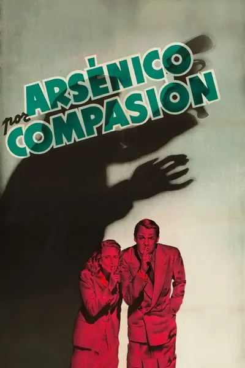

- disfrute: ★★★★★
- año: 1944
- género: comedia, crimen
- longitud: 1h58m

La vi dos veces del tirón en una semana, me parece una obra maestra.
Siento que ya no se hacen comedias como esta. El guión es maravilloso, y
la traducción también. Aunque soy un aférrimo defensor de ver las
películas en versión original, esta recomendaría verla en castellano.

Un crítico teatral que acaba de casarse decide visitar a sus ancianas
tías antes de marcharse de luna de miel. Durante la visita descubrirá
que las encantadoras viejecitas tienen una manera muy peculiar de
practicar la caridad.

### El gran dictador

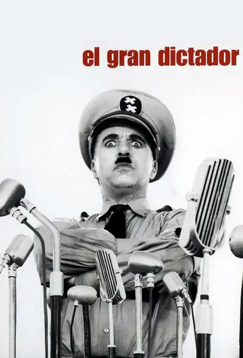

- disfrute: ★★★★★
- año: 1940
- género: comedia, bélica
- longitud: 2h05m

El discurso final es memorable.

Un humilde barbero judío tiene un parecido asombroso con el dictador de
la nación Tomania, que promete sacar adelante y que culpa a los judíos
de la situación del país. El dictador ataca al país fronterizo, pero es
confundido con el barbero por sus propios guardias, siendo ingresado en
un campo de concentración. Simultáneamente, el pobre barbero es
confundido con el dictador...

### Tiempos modernos

- disfrute: ★★★★★
- año: 1936
- género: comedia, drama, romance
- longitud: 1h27m

Es muy triste que sea tan actual...

Extenuado por el frenético ritmo de la cadena de montaje, un obrero
metalúrgico acaba perdiendo la razón. Después de recuperarse en un
hospital, sale y es encarcelado por participar en una manifestación en
la que se encontraba por casualidad. En la cárcel, también sin
pretenderlo, ayuda a controlar un motín, gracias a lo cual queda en
libertad. Una vez fuera, reemprende la lucha por la supervivencia en
compañía de una joven huérfana a la que conoce en la calle.

### El apartamento

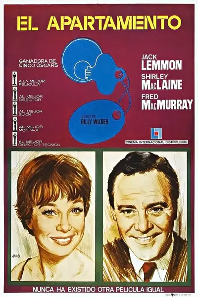

- disfrute: ★★★★★
- año: 1960
- género: comedia, drama, romance
- longitud: 2h05m

Otra comedia impresionante, con crítica social.

C.C. Baxter es un modesto pero ambicioso empleado de una compañía de
seguros de Manhattan. Está soltero y vive solo en un discreto
apartamento que presta ocasionalmente a sus superiores para sus citas
amorosas. Tiene la esperanza de que estos favores le sirvan para mejorar
su posición en la empresa. Pero la situación cambia cuando se enamora de
una ascensorista que resulta ser la amante de uno de los jefes que usan
su apartamento.

### La vida segun Philomena Cunk

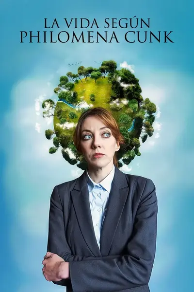

- disfrute: ★★★★☆
- año: 2024
- género: comedia
- longitud: 1h10m

## Conmovedoras

### Coco

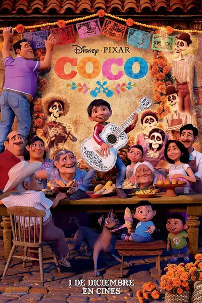

- disfrute: ★★★★★
- año: 2017
- género: animación, aventura
- longitud: 1h49m

Segunda vez que la veo y no pierde. Al principio me dio mucho miedo de
lo que podía hacer disney con méxico, pero la verdad es que es una obra
de arte.

Un joven aspirante a músico llamado Miguel se embarca en un viaje
extraordinario a la mágica tierra de sus ancestros. Allí, el encantador
embaucador Héctor se convierte en su inesperado amigo y le ayuda a
descubrir los misterios detrás de las historias y tradiciones de su
familia.

## Entretenidas

Un pasatiempos agradable. Para días tontos.

### La princesa prometida

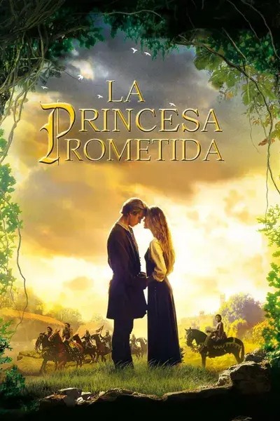

- disfrute: ★★★★★
- año: 1987
- género: Aventura, comedia, fantasía, romance
- longitud: 1h45m

Me resistí mucho tiempo a verla porque tenía miedo que fuese una ñoñería
de amor romantico. Que tristemente lo es xD, pero todo lo demás hace que
sea una maravilla. Los diálogos, las coreografías, los personajes... Eso
si, prepárate para exasperarte ante el papel de princesa objeto inútil.

Me volvió a despertar el sentimiento de "ya no se hacen películas como
estas". Tiene un algo que lo despierta (además de la retrogradez
machista)

Después de buscar fortuna durante cinco años, Westley retorna a su
tierra para casarse con su amada, la bella Buttercup, a la que había
jurado amor eterno. Sin embargo, para recuperarla habrá de enfrentarse a
Vizzini y sus esbirros. Una vez derrotados éstos, tendrá que superar el
peor de los obstáculos: el príncipe Humperdinck pretende desposar a la
desdichada Buttercup, pese a que ella no lo ama, ya que sigue enamorada
de Westley.

### Kneecap

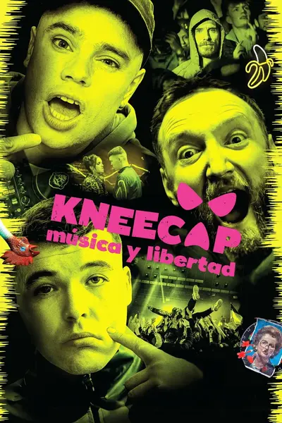

- disfrute: ★★★★★
- año: 2024
- género: Comedia, drama
- longitud: 1h45m

Me encanta que sean ellos mismos los que actuan, la historia está muy
chula y el grupo mola todo.

En Irlanda hay 80.000 hablantes de irlandés, 6.000 viven en el norte y
tres de ellos lo van a poner todo patas arriba cuando formen un trío de
rap llamado Kneecap. Anárquicos, salvajes y dispuestos a todo para
salvar su lengua materna.

### Inside Out 2

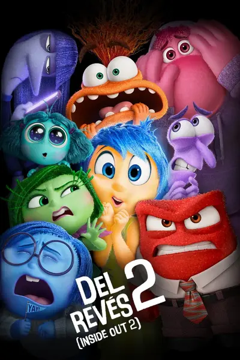

- disfrute: ★★★★★
- año: 2024
- género: animación, aventura, comedia
- longitud: 1h36m

Riley entra en la adolescencia y el Cuartel General de su cabeza sufre
una repentina reforma para hacerle hueco a algo totalmente inesperado
propio de la pubertad: ¡nuevas emociones! Alegría, Tristeza, Ira, Miedo
y Asco, con años de impecable gestión a sus espaldas (según ellos...) no
saben muy bien qué sentir cuando aparece con enorme ímpetu Ansiedad. Y
no viene sola: le acompañan envidia, vergüenza y aburrimiento.

### El tercer hombre

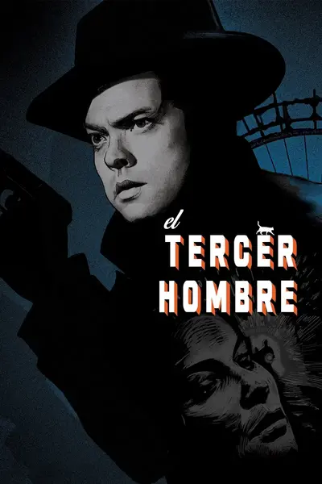

- disfrute: ★★★★★
- año: 1949
- género: misterio, suspense
- longitud: 1h44m

Orson Welles es Harry Lime y Joseph Cotten actúa como su amigo de la
infancia, Holly Martins, en este clásico thriller de Graham Greene,
dirigido por Carol Reed. Martins busca a Lime en la caótica postguerra
de Viena, y se encuentra así mismo metido en un entorno de amores,
decepción y asesinatos.

### Los Rose

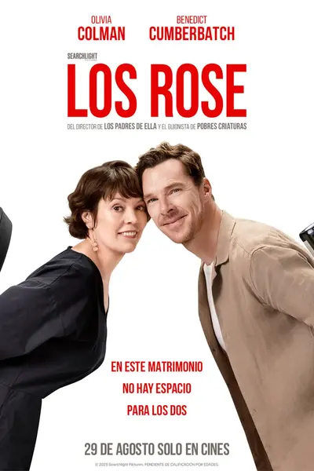

- disfrute: ★★★★☆
- año: 2025
- género: comedia, drama, romance
- longitud: 1h45m

La vida parece fácil para la pareja perfecta que forman Ivy y Theo:
carreras de éxito, un matrimonio feliz y unos hijos estupendos. Pero
detrás de la fachada de su supuesta vida ideal, se avecina una tormenta:
la carrera de Theo se desploma mientras que las ambiciones de Ivy
despegan, lo que desencadena una caja de Pandora de competitividad y
resentimiento ocultos.

### Una historia verdadera

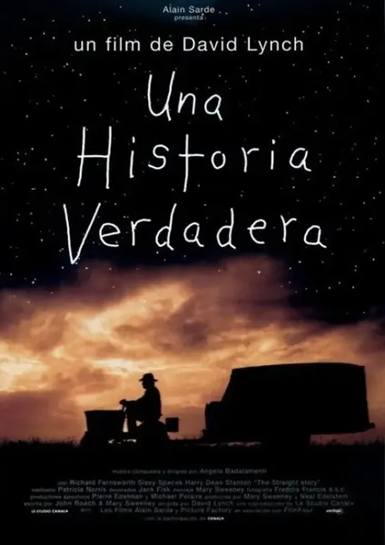

- disfrute: ★★★★☆
- año: 2025
- género: comedia, drama, romance
- longitud: 1h45m

Alvin Straight (Richard Farnsworth) es un achacoso anciano que vive en
Iowa con una hija discapacitada (Sissy Spacek). Además de sufrir un
enfisema y pérdida de visión, tiene graves problemas de cadera que casi
le impiden permanecer de pie. Cuando recibe la noticia de que su hermano
Lyle (Stanton), con el que está enemistado desde hace diez años, ha
sufrido un infarto, a pesar de su precario estado de salud, decide ir a
verlo a Wisconsin. Para ello tendrá que recorrer unos 500 kilometros, y
lo hace en el único medio de transporte del que dispone: una máquina
cortacésped.

### El mago de Oz

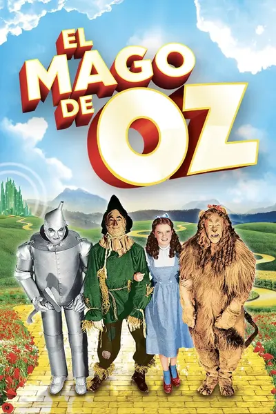

- disfrute: ★★★★☆
- año: 1939
- género: aventura, fantasía
- longitud: 1h43m

### La gran evasión

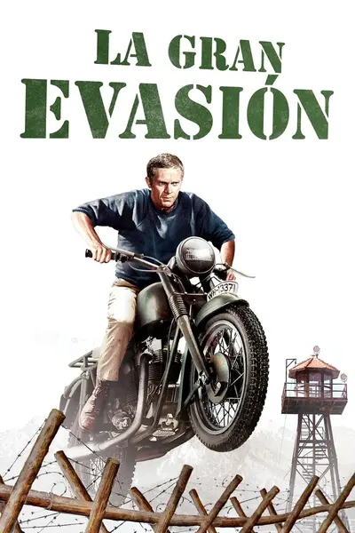

- disfrute: ★★★★☆
- año: 1963
- género: aventura, bélica, drama
- longitud: 2h43m

### La quimera del oro

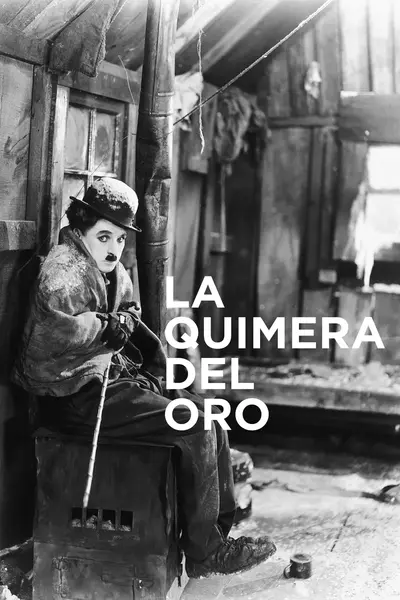

- disfrute: ★★★★☆
- año: 1925
- género: aventura, comedia, drama
- longitud: 1h35m

Aventuras de un solitario buscador de oro en Alaska, donde se topa con
varios personajes rudos, y se enamora de la hermosa Georgia, a la que
trata de conquistar.

### Mujeres al borde de un ataque de nervios

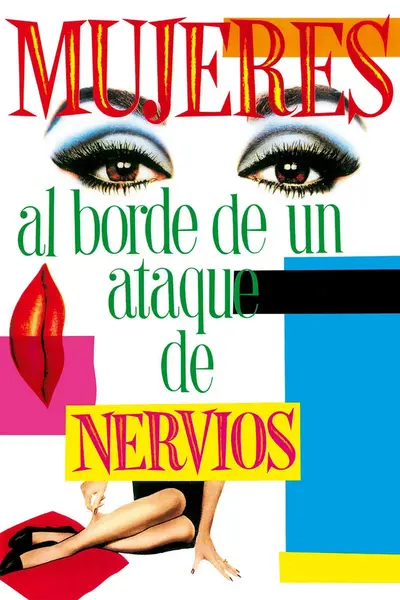

- disfrute: ★★★★☆
- año: 1988
- género: comedia, drama
- longitud: 1h28m

Pepa e Iván son actores de doblaje. Él es un mujeriego empedernido y,
después de una larga relación, rompe con Pepa: le deja un mensaje en el
contestador pidiéndole que le prepare una maleta con sus cosas. Al
quedarse sola, Pepa no soporta vivir en una casa llena de recuerdos y
decide alquilarla. Mientras espera que Iván vaya a recoger la maleta, la
casa se le va llenando de gente extravagante de la que aprenderá muchas
cosas sobre la soledad y la locura.

# Mejores podcasts de 2025

1. [Punzadas sonoras](#punzadas-sonoras)
1. [Quieto todo el mundo](#quieto-todo-el-mundo)
1. (de eso no se habla) temporada 2: Se llamaba como yo
1. [No es el fin del mundo](#no-es-el-fin-del-mundo)

## [Punzadas sonoras](https://punzadas.com/punzadas-sonoras/)

Paula Ducay e Inés García me han recordado la importancia de la Filosofía como nadie. Gracias a ellas he descubierto nuevas maneras de ver, me han regalado palabras que describen a la percepción pensamientos y sensaciones que tengo y gracias a ellas he conseguido esclarecer un poco más mi entendimiento del mundo y de mi mismo. En especial han sido la base para desenterrar pilares imprescindibles de mi vida como son el deambular creativo y la solitud.

Siento que mi camino con ellas ha sido perfecto, me enamoré de ellas en los derroteros de [Carne cruda](#carne-cruda) en 2023. Eran episodios de 20 minutos muy accesibles, y una vez que ya me enganché a ellas, los programas de una hora se hacen cortos.

Escucharlas es un absoluto placer.

## [Quieto todo el mundo](https://www.ivoox.com/podcast-quieto-todo-mundo_sq_f11778903_1.html)

Facu Díaz y Miguel Maldonado han conseguido alegrarme las horas de cocina de los lunes con la manera más amable de acercarme desde la comedia a la actualidad política. Hacen un combo maravilloso.

Con un tono divertido y relajado, en el programa van comentando desde la ignorancia, la improvisación y, en ocasiones, la desidia las noticias más importantes de la semana.

Esta misa roja ha creado una verdadera religión a lo largo de los programas, no sólo por el lore sino por el vacío existencial que dejan esa semana que no publican programa. Especialmente cuando es porque los nazis les ocupan los espacios, asco de pais...

## (de eso no se habla) temporada 3: Se llamaba como yo

En «De eso no se habla» hablamos de los silencios que crea esa frase, tanto en nosotras como en la sociedad: de las historias que se esconden detrás de ellos, y de qué pasa cuando los rompemos.

Esta tercera temporada trata sobre la memoria de la niña Begoña Urroz, sobre las cinco décadas de silencio de una familia… Y sobre el ruido que lo rompió. Muestra cómo la guerra sucia del estado contra ETA

## No es el fin del mundo

Una mirada muy interesante a la geopolítica mundial

El podcast semanal de El Orden Mundial (EOM) para entender qué pasa en el mundo. Análisis, contexto y matices sobre la realidad internacional. Porque estar al día de qué pasa más allá de nuestras fronteras no debería ser ni complicado ni aburrido.

# Mejores videojuegos de 2025

Mi juego favorito de este año ha sido [Thronefall](#thronefall)

## Thronefall

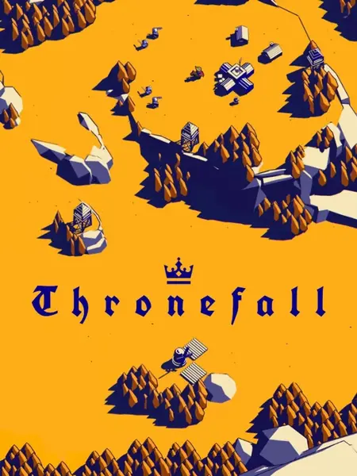

- disfrute: ★★★★★
- platforms: linux
- year: 2024
- genre: Strategy, tactical, puzzle, arcade

Al principio era un poco escéptico porque tienes unas localizaciones
fijas para las torres, pero sigue siendo un juego difícil y entretenido.
Además que los gráficos son preciosos.

A minimalist game about building and defending a little kingdom.
Thronefall is a classic strategy game without unnecessary complexity,
just some healthy hack-and-slay. Build up your base during the day, and
defend it 'til your last breath at night.

## [Dragonsweeper](dragonsweeper.md)

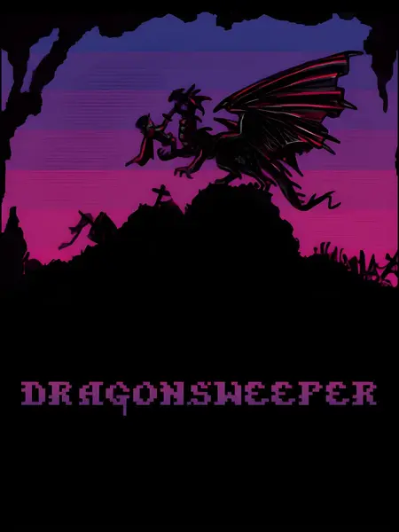

- disfrute: ★★★★★
- year: 2025
- genre: puzzle
- platform: desktop, mobile
- price: free

Simple de jugar pero muy adictivo.

A minesweeper game that requires observation by mixing roguelike
elements with the classic gameplay.

## You Must Build A Boat

- disfrute: ★★★★★
- platforms: android, linux
- year: 2015
- genre: puzzle

You Must Build A Boat is the sequel to the award winning "10000000".
Travel the world, run procedurally generated dungeons finding artifacts,
capturing monsters and recruiting crew for your...

## 10000000

- disfrute: ★★★★★
- platforms: android, linux
- year: 2012
- genre: puzzle

10000000 is an award winning hybrid RPG/Action/Puzzle game. Matching
tiles controls your character enabling you to explore, fight and loot.
When you are not facing monsters you will be back in your prison,
constructing buildings and getting stronger for your next run.
