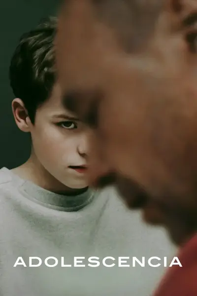
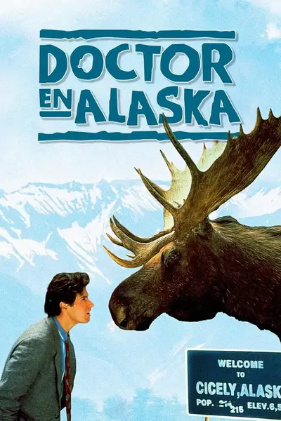
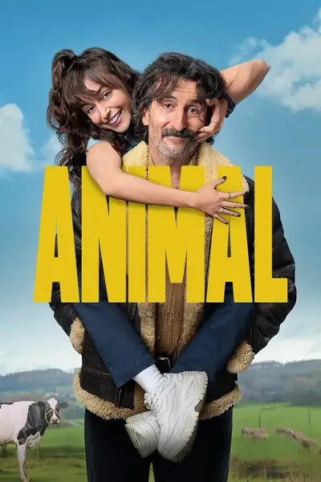

Aquí os dejo las series que más me han marcado en la vida. Podéis ver otras en las [galas](galas_2025.md).

# Impactantes

Contenido original, que deja su huella.

## Say nothing

- año: 2024
- género: drama
- longitud: 9 episodios
- última vez vista: 2025

Ambientada a lo largo de toda la historia del IRA, es interesante que no cuentan la versión de los vencedores, sin dejar de ser crítica con los vencidos. Me sorprendieron mucho los paralelismos con ETA.

Cada capítulo es una joya. Probablemente la mejor serie que he visto en 2025.

## Adolescencia

- disfrute: ★★★★★
- año: 2024
- género: drama, crimen
- longitud: 4 episodios largos e intensos
- última vez vista: 2025

Serie que engancha muy fuertemente, que nos hace reflexionar sobre la relación adulto - joven, el papel de la tecnología y a donde tiende el mundo.

Creo que es una serie que deberían de ver todos los padres y madres con sus hijes, también en los institutos. Creo que se podrían generar unos debates muy ricos.

El formato también es muy especial. La grabación contínua hace que la acción no te deje un respiro. Yo pensaba que el formato de grabación contínua lo conseguían haciendo cortes y uniéndolo con efectos gráficos, pero no. Cada capítulo está grabado de un tirón, y si se equivocan, a empezar de nuevo. Flipo.

Cómo actua todo el reparto es impresionante.

El único pero que le pongo es que sólo muestra una visión muy pesimista de la juventud, en la que es fácil caer en la desesperación de que no tienen remedio y nos vamos al carajo. Que aunque es cierto, también hay otra gran cantidad de jóvenes que vienen pisando con mucha fuerza sobre los que podríamos aprender mucho.

El mundo de una familia se pone patas arriba cuando Jamie Miller, de 13 años, es arrestado y acusado de asesinar a una compañera de clase. Los cargos contra su hijo les obliga a enfrentarse a la peor pesadilla de cualquier padre.

# Tiernas

Contenido de domingo noche, aquel que te abraza, que es calentito, en el que los personajes se convierten parte de tu familia.

## Doctor en Alaska

- disfrute: ★★★★★
- año: 1990
- género: comedia, drama, fantasía
- longitud: 110 episodios
- última vez vista: 2024

Zona de comfort absoluta que ha envejecido genial. Después de verla hace unos años, he revisitado capítulos sueltos con la familia. Si no la has visto es un acompañamiento bueno para el invierno.

Joel Fleishman es un médico recién licenciado. Debido a una cláusula de la letra pequeña del contrato de su beca acaba en la remota y descaradamente extraña ciudad de Cicely (Alaska). Cordialmente bienvenido por el fundador de Cicely, Maurice Minnifield, antiguo astronauta de la NASA, y por el resto de la peña de inadaptados y excéntricos que forma el vecindario, Joel descubre que es cada vez más difícil abandonar la ciudad a la que inconscientemente ha llegado. Todo se complica por la presencia de Maggie O'Connell, alcaldesa de Cicely y piloto de la localidad, una mujer hermosa pero completamente independiente; ambientado todo ello por el musical y filosófico programa de radio presentado por Chris en la KBHR.

# Graciosas

Contenido que arranca carcajadas

## División Palermo

- disfrute: ★★★★☆
- año: 2025
- género: comedia
- longitud: 6 episodios

Quizá es por la pérdida de novedad, pero no me reí tanto como con la primera. Aun así tiene muchos puntos muy muy graciosos.

Una Guardia Urbana inclusiva, ideada como operación de marketing para mejorar la imagen de las fuerzas de seguridad, descubrirá algo que no debía y se enfrentará con unos extraños narcos.

## Animal

- disfrute: ★★★★★
- año: 2025
- género: comedia
- longitud: 9 episodios
- última vez vista: 2025

La serie más graciosa que he visto en el 2025. Carcajada tras carcajada, la retranca gallega en todo su explendor. Mais unha pena que non fose en galego :(

Antón, un veterinario sin un duro, acepta trabajar en una tienda de mascotas de lujo y pasa de cuidar animales en el campo a vender cucaditas y caprichos para perros mimados.

